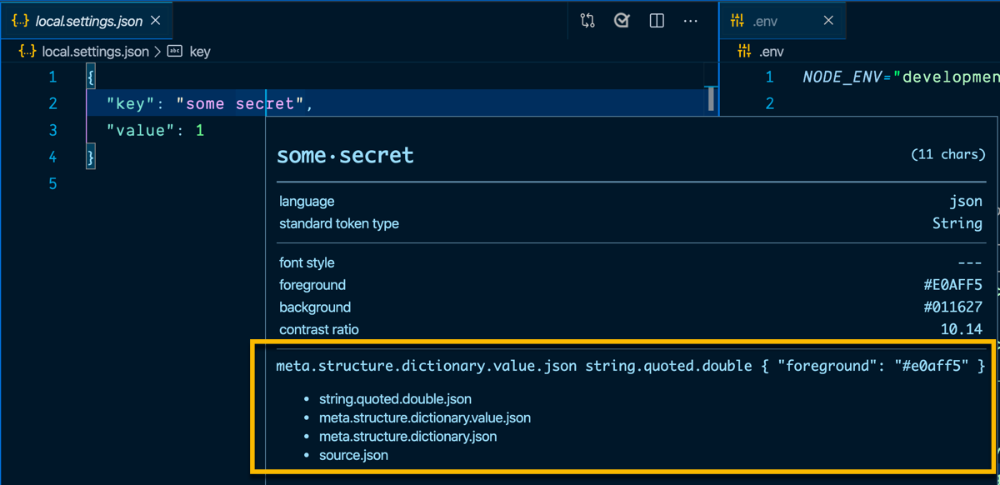

# Cloak for Visual Studio Code

Cloak hides/shows your secrets in environment files, to avoid accidentally sharing them with everyone who sees your screen.

Cloak can be useful if you:

- present on stage
- stream on Twitch or YouTube
- record screencasts of your code

## Install

1. Open **Extensions** sideBar panel in Visual Studio Code and choose the menu options for **View → Extensions**
1. Search for `Cloak`
1. Click **Install**
1. Click **Reload**, if required

## Quick Usage

Let's see Cloak in action!

1. Open a `.env` file
1. Press `F1` to open the command palette
1. Type `Cloak`
1. Choose `Cloak: Hide Secrets`

Now enjoy exploring the rest of the features explained in the docs!

## Settings

| Property                  | Description                                                                  |
| ------------------------- | ---------------------------------------------------------------------------- |
| cloak.hideComments        | Specifies whether comments will be affected                                  |
| cloak.environmentKeys     | Specifies the scopes for the environment keys that will be affected          |
| cloak.environmentComments | Specifies the scopes for the environment file comments that will be affected |

## Commands

| Command                    | Description                                        |
| -------------------------- | -------------------------------------------------- |
| cloak.restoreDefaultScopes | Restore the default TextMateRules scopes           |
| cloak.hideSecrets          | Hide the secrets                                   |
| cloak.showSecrets          | Show the secrets                                   |
| cloak.toggleSecrets        | Hide/Show the secrets (opposite of current effect) |

### Issues

Please refer to the [issues list and feel free to grab one and contribute](https://github.com/johnpapa/vscode-cloak/issues)!

### How it Works

here are the really important aspects of Cloak:

- Cloak does not modify your files
- Cloak does not store any information about your secrets
- Cloak does change the foreground color to an alpha color of 00, which makes the secret transparent and hidden

Cloak uses TextMateRules scopes to match syntax found in the VS Code editor. When it finds a match, these values can be hidden or shown.

Only TextMateRule scopes apply. This means that if those scopes do not exist for a specific key or secret you want to hide, it cannot be done with cloak. You can determine if the scope you are looking for will work by using the _Developer: Inspect Editor Tokens and Scope_ command from the command palette, then selecting the key and seeing the scope.

If you want to add or modify the scopes that apply to your secrets, you may change them in the _settings.json_ for VS Code. Find the setting for `cloak.environmentKeys` and modify as needed. If you ever need to revert to the defaults, choose the command `Cloak: Restore default scopes`.

### Logging

Cloak writes to VS Code's log output. You can open the output panel and select "Cloak" to see the log. This can be helpful when reporting issues.

## Changes

See the [CHANGELOG](/changelog) latest changes.

## FAQ

### Does Cloak work in files other than `.env` files?

Not currently. Cloak relies on the TextMateRules and scopes that VS Code supports. These currently only support known scopes, and there is no way I could find that would narrow down the contents of specific files. If this changes, or if you have ideas, please consider proposing a Pull Request.

## Try the Code

If you want to try the extension out start by cloning this repo, `cd` into the folder, and then run `npm install`.

Then you can run the debugger for the launch configuration `Run Extension`. Set breakpoints, step through the code, and enjoy!

## Resources

- [Get VS Code](https://code.visualstudio.com/?WT.mc_id=javascript-0000-jopapa)
- [Create your first VS Code extension](https://code.visualstudio.com/api/get-started/your-first-extension?WT.mc_id=javascript-0000-jopapa)
- [VS Code Extension API](https://code.visualstudio.com/api/references/vscode-api?WT.mc_id=javascript-0000-jopapa)
- [Learn how to add WebPack bundles to your favorite extensions](https://code.visualstudio.com/updates/v1_32?WT.mc_id=javascript-0000-jopapa#_bundling-extensions-with-webpack?wt.mc_id=cloak-github-jopapa)
- [Try Azure Free](https://azure.microsoft.com/free?WT.mc_id=javascript-0000-jopapa)

## Credits

Inspiration comes in many forms. These folks and teams have contributed either through ideas, issues, pull requests, or guidance. Thank you!

- Thanks to [John Lindquist](https://twitter.com/johnlindquist) and [Wes Bos](https://twitter.com/wesbos) for the inspiration.

- The VS Code team and their incredibly [helpful guide for creating extensions](https://code.visualstudio.com/api/get-started/your-first-extension?WT.mc_id=javascript-0000-jopapa)

- Here are some great [examples for extensions](https://github.com/Microsoft/vscode-extension-samples) from the VS Code team

## Contributors

Thanks goes to these wonderful people ([emoji key](https://allcontributors.org/docs/en/emoji-key)):

<!-- ALL-CONTRIBUTORS-LIST:START - Do not remove or modify this section -->
<!-- prettier-ignore-start -->
<!-- markdownlint-disable -->
<table>
  <tr>
    <td align="center"><a href="http://johnpapa.net"> <b>John Papa</b></a> <a href="#infra-johnpapa" title="Infrastructure (Hosting, Build-Tools, etc)">🚇</a> <a href="https://github.com/johnpapa/vscode-cloak/commits?author=johnpapa" title="Tests">⚠️</a> <a href="https://github.com/johnpapa/vscode-cloak/commits?author=johnpapa" title="Code">💻</a></td>
  </tr>
</table>

<!-- markdownlint-enable -->
<!-- prettier-ignore-end -->

<!-- ALL-CONTRIBUTORS-LIST:END -->

This project follows the [all-contributors](https://github.com/all-contributors/all-contributors) specification. Contributions of any kind welcome!
